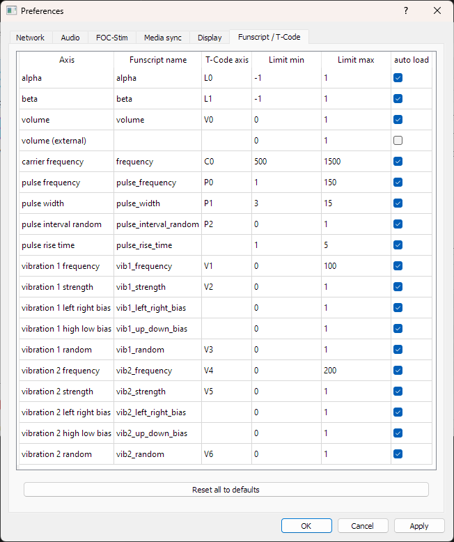
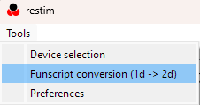
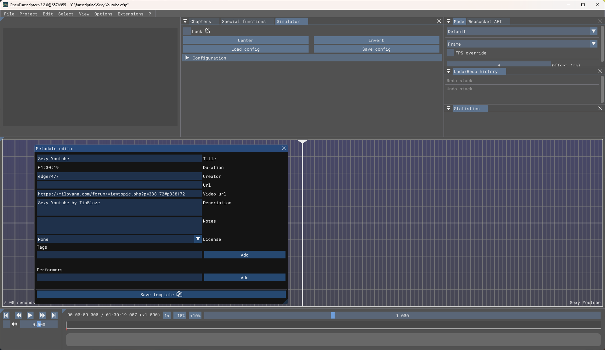
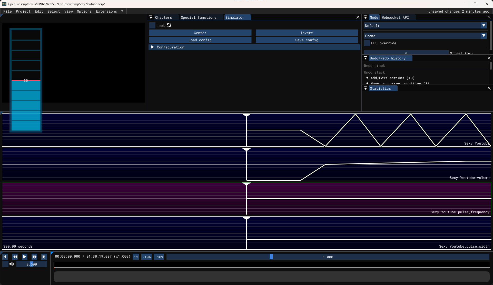

# Introduction to scripting for restim using OFS

  

This tutorial covers the basics of creating funscripts for video files that can be played by restim.

I am using [OpenFunscripter v3.2.0](https://github.com/OpenFunscripter/OFS/releases/tag/v3.2.0) (OFS)

  
## File naming conventions

Before starting on your first set of scripts, you should know how the files are named and what is purpose of each of them.

File name conventions are rules how the funscript files are named. For all of them we will refer to the name of original video file without extension as ***filename***. In this example, for file that is named **Sexy Youtube.mp4**, the filename will be **Sexy Youtube**. Restim uses several files for different axes, that I will list here in order of importance.

  

As a side note, these file names are just *defaults*, as in *default configuration of restim*, that you can see in preferences => Funscript / T-Code:

Since funscript format allows value of axis to be decimal between 0 and 1, in this screen you can also see the ranges (Limit min / Limit max) to which the values are mapped.
  

#### 1. **positional axes (stroking/alpha/beta)**:

   The *default* funscript file, which contains *stroking* movement is named *filename.funscript*

   You might often find this file already available for many of the videos (i.e. on eroscripts.com), since this same file is used for strokers. It contains position of stroker along the time axis.     This file is not *directly* used by restim, but 2 files for spatial positioning of the estim sensation in 2d space, called *filename.alpha.funscript* (for vertical axis) and *filename.beta.funscript* (for horizontal axis) can be generated from this file, by using funscript conversion tool in restim app:

   

   Since *default* way of creating *alpha* and *beta* funscripts is by using this conversion, this tutorial is going to be based around it.

  

#### 2. **volume axis**
   
   This file is named *filename.volume.funscript*
   In simplest use-case you create it manually. This axis controls the intensity of estim, and usually also contains a ramp over time, where a good starting value is 0.5% - 0.7% per minute (if it is very long video, like 2 hours, then you would use slower ramp). I will cover more advanced ways for creating this axis in separate page.

#### 3. **pulse frequency**   
   
   This file is named *filename.pulse_frequency.funscript*
   The mapped value of this axis controls the number of wavelets that are created per second.

#### 4. **pulse width**   
   
   This file is named *filename.pulse_width.funscript*
   The mapped value of this axis controls the *length* (number of carrier oscillations) of each wavelet produced.
   
#### 5. **pulse rise time**
   
   This file is named *filename.pulse_rise_time.funscript*
   The mapped value of this axis controls how fast (in number of carrier oscillations) the wavelet reaches the current signal intensity (volume).

#### 6. **frequency**
   
   This file is named *filename.frequency.funscript*
   The mapped value of this axis controls the carrier frequency that is used to produce wavelets. It is not recommended to use this axis for stereostim boxes since lower frequency generally produce stronger perceived intensity and it is impossible to make uniform compensation for this that would work on all boxes.

### a tip
For the axes 3-6 (pulse frequency/width/rise time and carrier frequency) you can use Pulse settings tab in Restim UI to view illustration of wavelets produced and get better idea how these numbers affect shape of the signal.

## Starting your first project

To start when you want to create new OFS project for new video, you can just right click the video and choose Open With -> OpenFunscripter.exe
  

You will be met with metadata window that you can optionally fill then close and you have empty project. 

The usage of OFS tool will not be covered here, if it is new for you, I recommend [this tutorial](https://discuss.eroscripts.com/t/how-to-script-in-openfunscripter-video-tutorial/16637/1)

When starting work on set of scripts for Restim in OFS, the first thing is to create the project (as mentioned by opening the video file, the *default* funscript appears automatically), and add any funscript axes you plan to use.
For example, adding *volume*, *pulse_frequency* and *pulse_width* (according to filename conventions above), and you have basic project where you are ready to start working:

You can see the file name for each added axis in the bottom right corner of that axis's timeline.

Saving this project creates *filename.ofsp* in same folder with video that you can open and work on at any time.

### Important to remember
Default (stroking) axis won't be covered in this tutorial since that is subject of already linked tutorial for OFS, except one detail:
For any video where you want to create calibration signal, you need to add stroking if there isn't one in existing funscript. On screenshot above you can see that stroking starts along with increase of *volume* to 50%, which then slowly increases to 60% during half of calibration, and then stays there for other half.
The values for volume and other axes are covered in dedicated documents, this is only to underline the need of stroking movement during calibration signal.

And, for every edit of funscripts in this project, don't forget to perform export (File -> Export) and then whenever you changed stroking script, perform conversion to alpha/beta using Restim tools.
