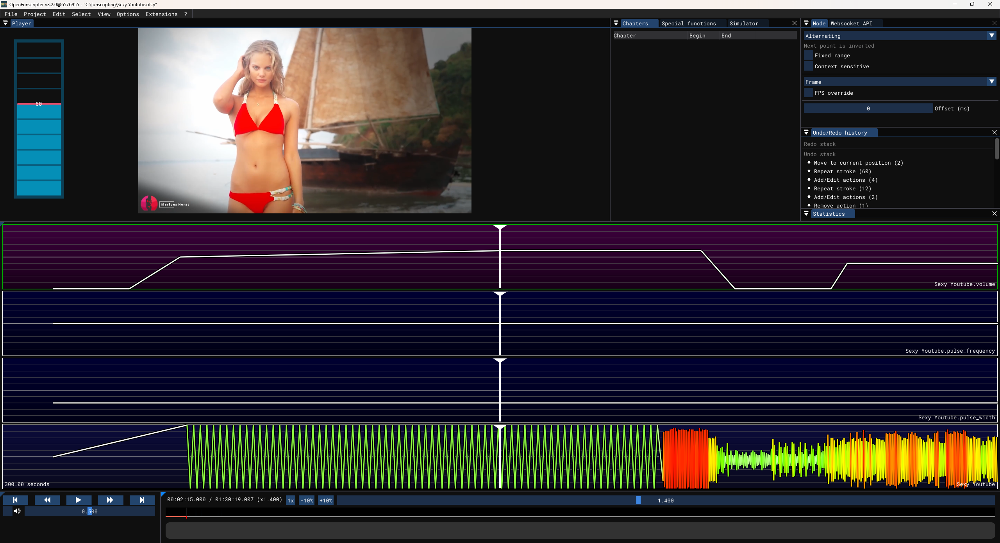
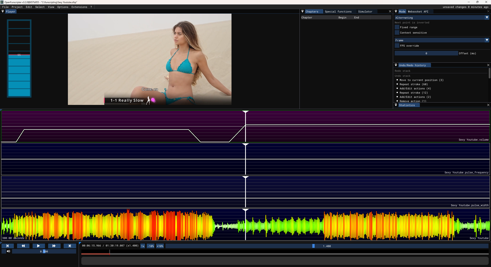
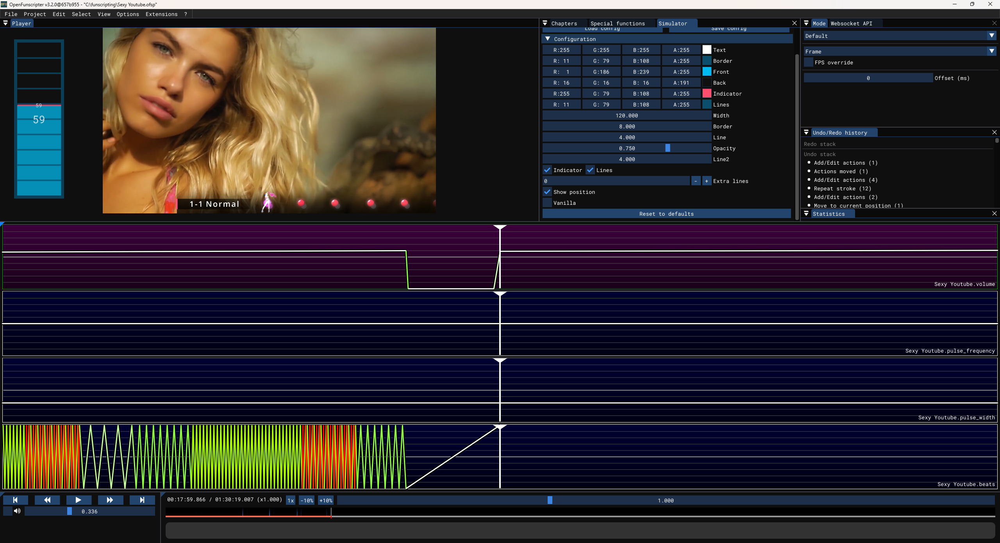

# Creating your first set of scripts

When starting work on set of scripts for Restim in OFS, the first thing is to create the project (as mentioned in introduction, by opening the video file, the *default* funscript appears automatically). 

Next step is to add any funscript axes you plan to use.

For example, adding *volume*, *pulse_frequency* and *pulse_width* (according to filename conventions above), and you have basic project where you are ready to start working:

You can see the file name for each added axis in the bottom right corner of that axis's timeline.

Saving this project creates *filename.ofsp* in same folder with video that you can open and work on at any time.

## Defaults

Before starting to work on any details, I like to set *defaults* for axes, and I use these points on start and end of the video (you might not use all axes for all videos but these are defaults that I use, 50 for the reason is "middle", and 30 for pulse width to have lower duty cycle in restim):
- pulse_frequency: 50
- pulse_width: 30
- pulse_rise_time: 50
- frequency: 50

### Important to remember
Default (stroking) axis won't be covered in too much detail in this tutorial since that is subject of already linked tutorial for OFS, except one detail:
For any video where you want to create calibration signal, you need to add stroking if there isn't one in existing funscript. On screenshot above you can see that stroking starts along with increase of *volume* to 50%, which then slowly increases to 60% during half of calibration, and then stays there for other half.
The values for volume and other axes are covered in dedicated documents, this is only to underline the need of stroking movement during calibration signal.

And, for every edit of funscripts in this project, don't forget to perform export (File -> Export) and then whenever you changed stroking script, perform conversion to alpha/beta using Restim tools.

### Optional

> For current example I am using for tutorial (Sexy Youtube), I have created a funscript using [PythonDancer](https://github.com/NodudeWasTaken/PythonDancer). In order to replace current 'default' (stroking) script in OFS you need to use menu Project -> Remove -> filename.funscript, then Project -> Add -> Add existing and chose the file.
> 
> Since I have created that music-based version, I am using that as a "base", but this video is actually a cock hero with pretty precise JOI, so some of the things will need to be adjusted to make this more immersive experience.

I'll start with calibration section. The project is available for download [here](Sexy_Youtube_1.ofsp) so you can check it for yourself, but I will describe the steps so you can understand the process.
By looking at the video I decided to make calibration run from 00:38 to 03:15.
Since this video is 90 minutes long, if we use mild ramp of 0.5% per minute that is 45% of ramp, so start should be around 55%. I decided to have calibration run from 50% to 60% at 2:15 and then stay at 60% for another minute. For most of calibration run I decided to delete part of funscript generated by PythonDancer and implement constant stroking in tempo that is shown at start. It is very simple to do since you just set the axis value to 100 at first beat, 0 at second, 100 at third and then can just 'fill' the rest by repeatedly pressing Home key. Since this is calibration it does not matter too much if they don't match the song perfectly.

I return the volume to 0 after calibration.

Next, there is verbal teasing section running from 04:00 to 05:40. I will set it to 40% there, and then back to 0.

First strokes start at 06:15 and there I will bring volume to 55%.

For now, this is all that I will do with volume, I leave it to linearly ramp up to 100 on 1:25:55 and then go to 0 towards the end. This means our ramp actually is not over 90 minutes but over 79 (from 6 to 85), but since I used mild ramp of 0.5% that is great - the actual one is now 45% over 79 minutes = 0.57% per minute, which is ok value (I used 0.7% in some projects and it was not too aggressive).

If we were trying to just create *anything* we want to call estim, then what is done so far could be already called a very simple estim, we could just export funscripts now and call it done.
Of course, if you want to create something immersive, interesting and enjoyable, then you need to invest more love and work into your creation.

## Create beats and add stop sections to volume axis

In this case, I want to make estim for this correspond to actual JOI that are in voiceover and synced to the on-screen beats that creator (Tia.Blaze) intended here. This is why I am going through the video and creating funscript that is based of beats. There are multiple ways you could do this, the best is if creator exports beatmeter timestamps, then you could convert them to funscript, but here I will just go and manually create pattern on each change, then select it, copy and paste it until I reach next pattern.
As I reach "stop" instruction, I switch to volume axis, I note the current value (to see it go to Simulator => check Show Position like in screenshot), and then create one point that is equal to current value, play a bit and set 0 (to remove estim according to stop instruction), and then as it is about to start, set another 0 value few seconds before, and previous value again to resume, just like in screenshot.

I have actually hidden the default .funscript timeline here and created .beats track, this is because I did not want to delete whole generated track in case there is some teasing section that I will leave synced to music, so I work on another track that I use as working space, and will copy it to the stroking axis.

As you will see later, creating your own tracks can be very helpful because there are ways to combine them in different ratios to create interesting effects that are progressive/gradual without spending too much time on them.
You can download current version of project (snapshot from screenshot above) [here](Sexy_Youtube_2.ofsp)

From there, I entered beats into beats axis to the end, and then copied it to the default axis, but left "freestyle/you decide" sections with generated-from-music funscript. Since I left volume in these sections at 0, the stroking has no effect, but in case someone wants to change their freestyle section, it makes it easy as they will only need to change volume.

This now makes even better version of estim done. There is volume axis and stroking. There is snapshot of project [here](Sexy_Youtube_3.ofsp). 
Note that I made sure that all scripts have a value at start and end of file, just to avoid having any of them be undefined at some time periods.

For me, this is still not done, not even volume, and we will cover [how to make it interesting in next part](03_making_your_script_interesting.md).